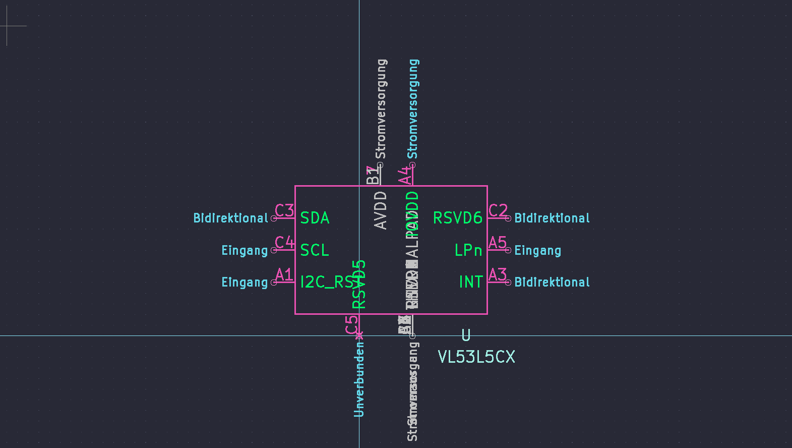
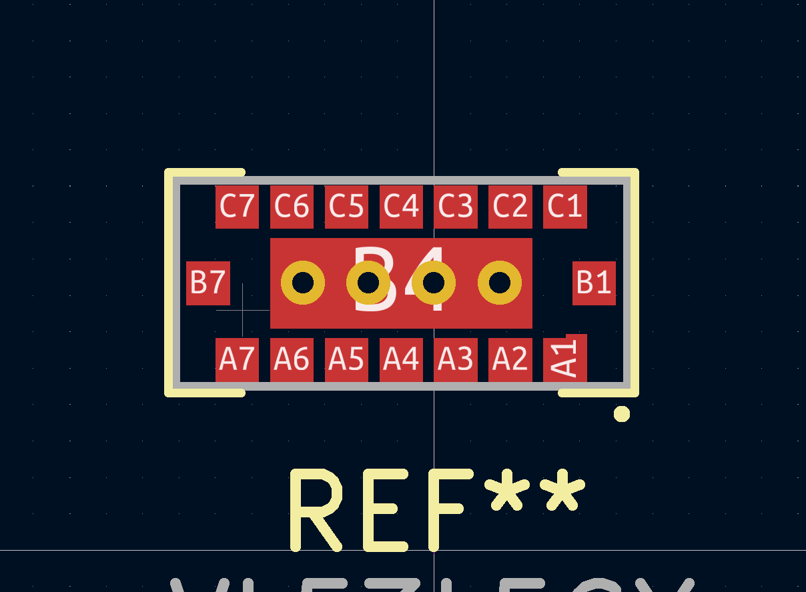
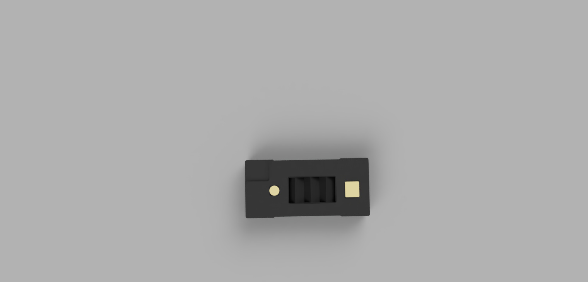
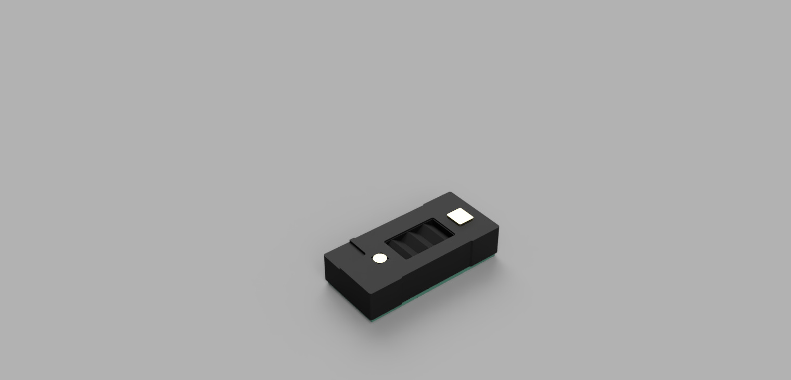
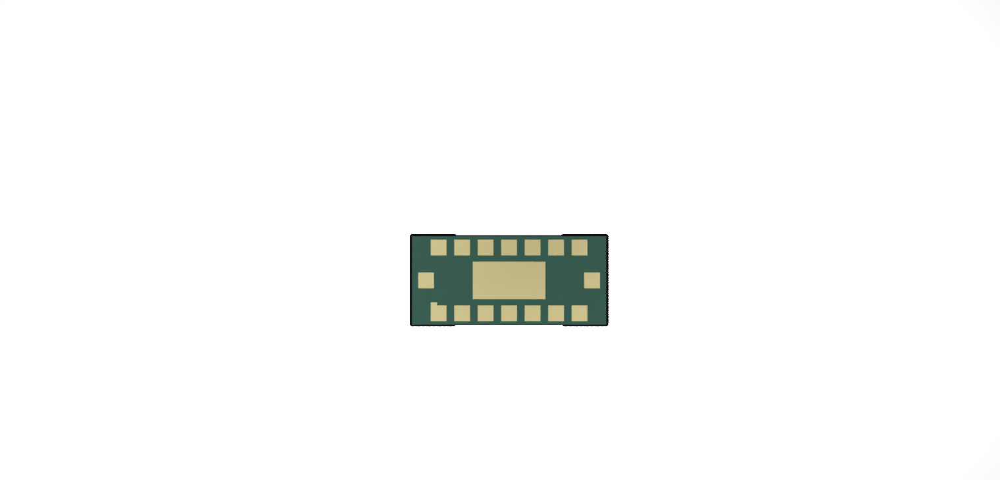

# ST Microelectronics VL53L5CX KiCad Model including symbol, footprint and 3D Model

- I created the following files to use the VL53L5CX in a PCB Design. 
- The Design was created from the Data provided in the datasheet by ST.

Symbol VL53L5CX

Footprint VL53L5CX

3D Model VL53L5CX

