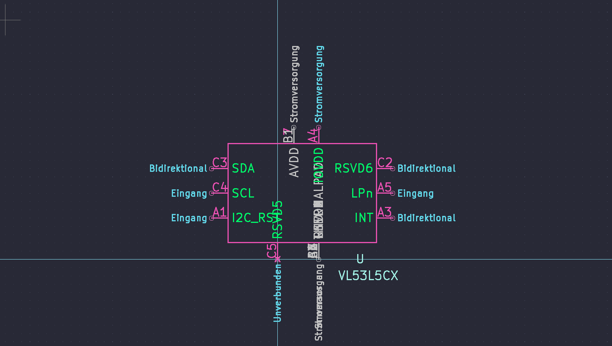
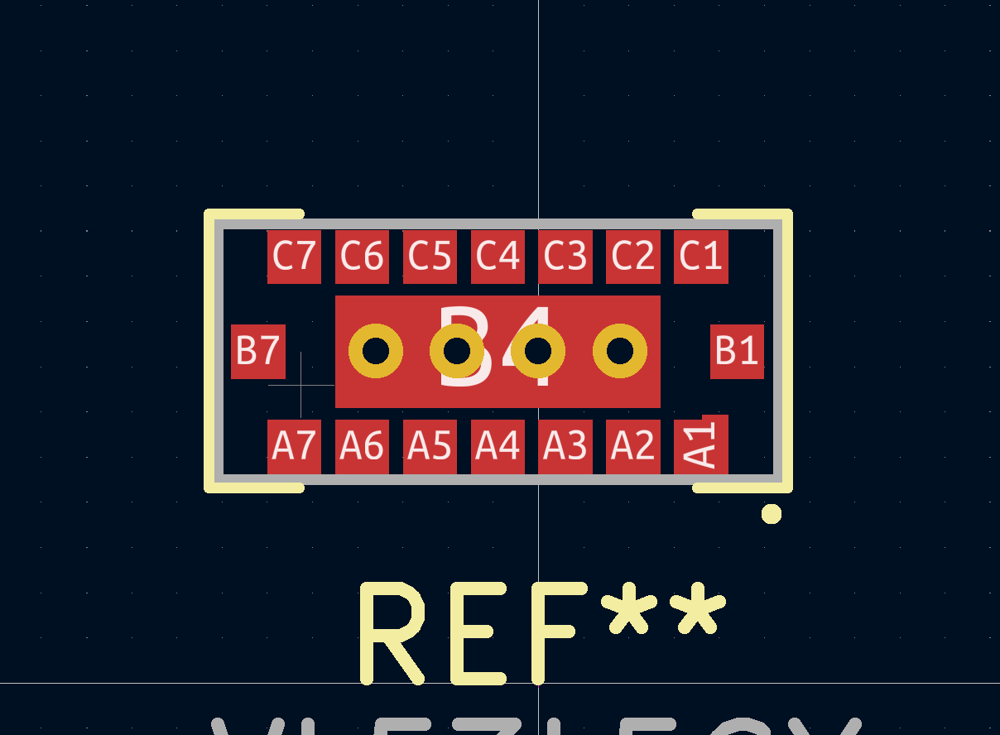
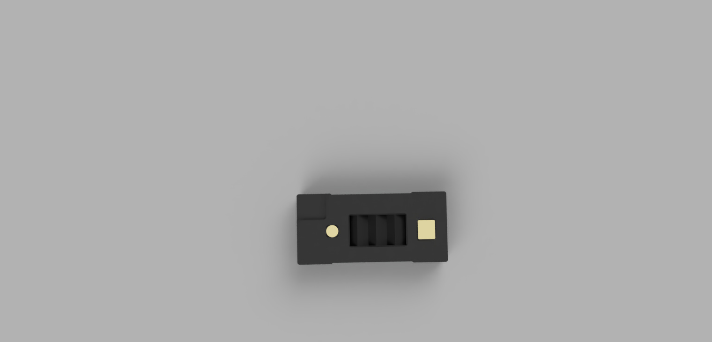

# ST Microelectronics VL53L5CX KiCad Model including symbol, footprint and 3D Model

- I created the following files to use the VL53L5CX in a PCB Design. 
- The Design was created from the data provided in the datasheet by ST.
- Dimensions and additional Information can be found in the datasheet

## Symbol VL53L5CX

## Footprint VL53L5CX

- **The footprint has 4 thermal vias**
- **Via size 0.6mm and drill size 0.3mm**

*For more Information about Thermal guidelines please refer to Application Note AN5657*

*It is recommended to adjust the Paste Layer 10% smaller than the Pad Size*

## 3D Model VL53L5CX

